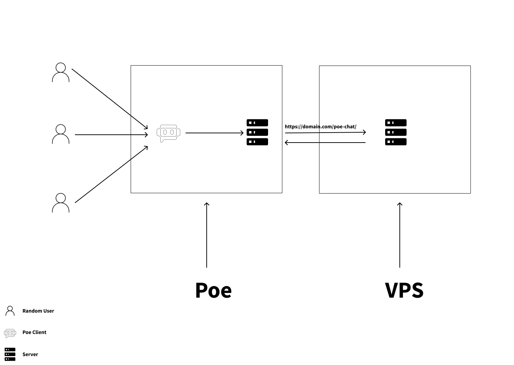

# Install and Deployment Instructions

The purpose of this project is to deploy a bot accessible via the Poe server at `https://domain.com/poe-chat/` or `https://subdomain.domain.com/poe-chat/`. <br/>
There are three Python files, each playing a specific role. The database has already been created, so the first file, `01create_database.py`, is not relevant for us. The most important files are `02query_llm.py` and `03freqragbot.py`.



## Requirements

1. **Google account**  
   You will need a google account to setup a project, gemini api and to get an api key

2. **Domain Name**  
   You will need a domain name with SSL to point to the IP address of your VPS.

3. **Poe Account**  
   You need a Poe account to get an access key and set up your bot.

4. **VPS**  
   A VPS to host the server and run the code.

### Google API Setup
   - Go to Google Cloud and set up your project with the Gemini API enabled. 
   - Copy your API key and add it to the `.env` file as:  
     `GOOGLE_API_KEY=yourapikey`

### Domain Name
   - Obtain a domain name or subdomain, and modify the A record to point to your VPS's IP address.

### Poe Account
   - Head to [Poe's quick start guide](https://creator.poe.com/docs/quick-start) and follow the instructions to create a bot.  
   - On the bot creation page, get your **Access Key**, copy it, and paste it into the `.env` file as:  
     `POE_ACCESS_KEY=youraccesskey`  
   - **Important**: Do not fill in the **Server URL** field yet, and don't close the page until you have the bot running on your VPS.

### VPS Setup
   - Connect to your VPS via SSH and install Nginx on Ubuntu with the following command:
     ```bash
     sudo apt install certbot python3-certbot-nginx
     ```

   - Generate an SSL certificate for your domain:
     ```bash
     sudo certbot --nginx -d yourdomain.com
     ```

   - After SSL generation, link the default Nginx site configuration:
     ```bash
     sudo ln -s /etc/nginx/sites-available/default /etc/nginx/sites-enabled/
     ```

   - Next, refer to the default configuration files in the repository and make the necessary adjustments.

## Upload, Run, and Test

### Upload
Upload the project folder to your VPS using `scp`, then create a virtual environment and install dependencies by running:
```bash
pip install -r requirements.txt
```

### Run
Run the project by doing ```python 03freqragbot.py``` <br/>
and you should see uvicorn running.

### Test if Poe server have access to our server
Return to the bot creation page and below Access Key field there is **Run check** button click it and  if everything is ok you will have in green **"Check successful. Your server is reachable."**. <br/>
Proceed to create your bot on the page and voila ! <br/>


**Don't forget to rename .env.example to .env and fill the required values.**
